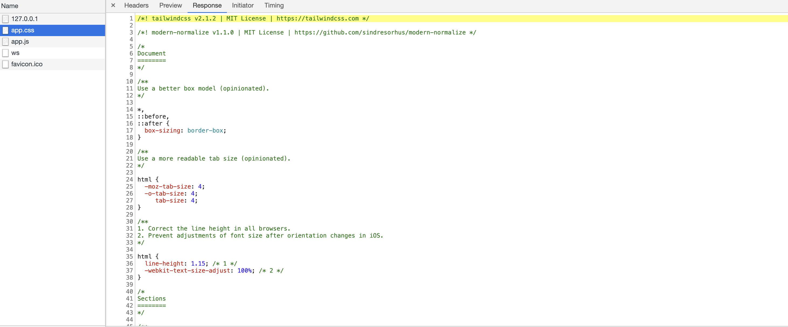

# adonis-with-tailwindcss
## Install tailwindcss with adonisJS 5

__1.__ Install tailwindcss, postCss & autoprefixer
```
npm install -D tailwindcss@latest postcss@latest autoprefixer@latest
```

__2.__ Initialize tailwindcss config file
```
npx tailwindcss init
```

__3.__ Create postcss.config.js file, with configs
```javascript
const tailwindcss = require('tailwindcss')
const autoprefixer = require('autoprefixer')

module.exports = {
  plugins: [
    tailwindcss,
    autoprefixer,
  ]
}
```

__4.__ Enable support postCSS in webpack config (webpack.config.js)
```javascript
Encore.enablePostCssLoader()
```

__5.__ Install postcss-loader 
```
npm install -D postcss-loader
```

__6.__ execute adonis serve to compile (in watch mode)
```
node ace serve -w
```


__7.__ Tailwindcs is installed & compil in apps.css, Let's working !




__Stack used :__
- node : v14.17.0
- npm : 6.14.13

__Sources :__
- adonisJS doc : 
  - [activate postCss](https://docs.adonisjs.com/guides/assets-manager#setup-postcss)

- Tailwindcs doc:
  - [Install tailwindcss](https://tailwindcss.com/docs/installation)
  - [Congfiguration](https://tailwindcss.com/docs/configuration)
  - [JIT](https://tailwindcss.com/docs/just-in-time-mode)

- PostCss:
  - [Site](https://postcss.org/)
  - [Github repo](https://github.com/postcss/postcss)
  - [plugins list](https://www.postcss.parts/)

- videos :
  - [RomanLanz Twicth explain how to install & config tailwind css](https://www.twitch.tv/videos/1024929427) (possible 404)
  - [Explain postCss from grafikrat (fr)](https://grafikart.fr/tutoriels/postcss-663)

